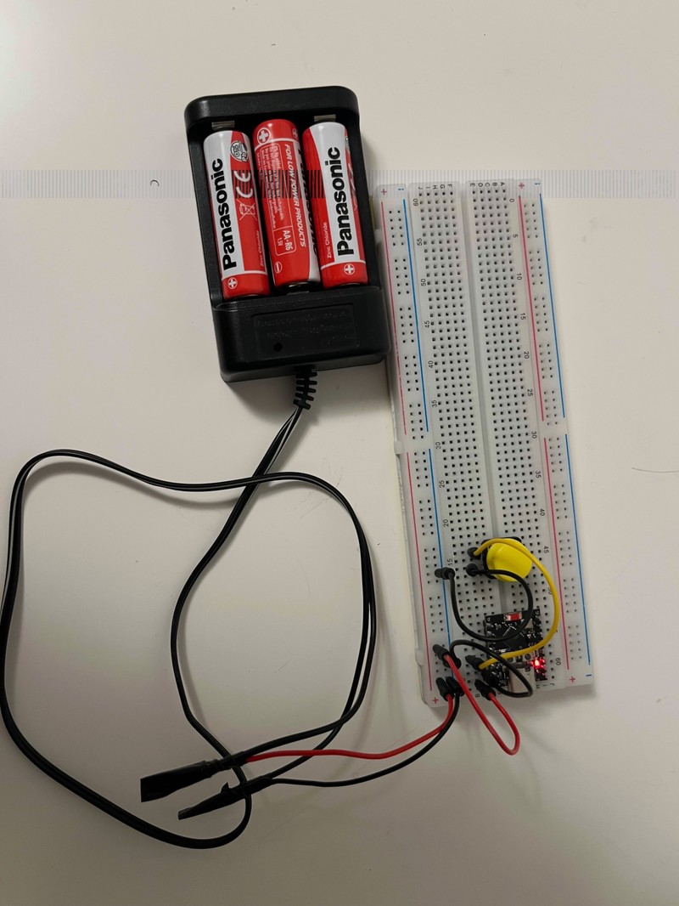

# ESP32-C3 Wi-Fi Station, Power Management & Telemetry Example

This project demonstrates a production-ready implementation of a battery-optimized Wi-Fi station application on the ESP32-C3 platform using the ESP-IDF framework. It serves as a benchmark blueprint for handling high-performance network tasks alongside aggressive, ultra-low-power sleep states.

## Core Features

* **Resilient Wi-Fi Station Infrastructure:** Connects to standard 2.4GHz access points using a safe connection handshake sequence to prevent connection timeouts.
* **Automatic Light Sleep Control:** Employs FreeRTOS Tickless Idle paired with dynamic Wi-Fi Modem Sleep configurations, allowing the device to drop down to sub-milliamp levels (~300µA) between router beacons while remaining fully network-connected.
* **MQTT Remote Control:** Listens on the `device/commands` MQTT topic. Processing the string command `"sleep"` gracefully cuts network sockets and initializes deep sleep.
* **MQTT-Triggered HTTPS OTA Updates:** Listens on the `device/ota` topic for an upgrade payload. When a payload is received, the device spins up a secure asynchronous worker task, dynamically forces the radio back into full-performance mode (`WIFI_PS_NONE`) to prevent TLS timeouts, streams the update down via HTTPS, flashes the passive app slot, and reboots.
* **Dual-Wakeup Deep Sleep Mode:** Shuts the silicon down to absolute minimums (~5µA). The device is configured to wake up automatically after 30 seconds via the internal hardware RTC timer **OR** immediately when an external tactile push-button is pressed.
* **Metadata Telemetry Generation:** Tracks running image descriptors (versioning parameters, compile dates, and active boot partitions).


## System Architecture & Power States

To maximize battery life without severing active network communication links, this project actively manages its radio and CPU clock states depending on immediate peripheral demands.

### Power Save Mode Comparison Matrix

| Operational State | Wi-Fi Power Save Profile | Average Current | Network Responsiveness | Use Case / Wakeup Event |
| :--- | :--- | :--- | :--- | :--- |
| **Connecting / Active Transmitting** | `WIFI_PS_NONE` | `~25mA - 80mA` | Instantaneous ($<2\text{ms}$) | Initial 4-way authentication handshakes, heavy MQTT payloads, and active OTA updates. |
| **Idle Connected Loop** | `WIFI_PS_MAX_MODEM` | `< 1.0mA` | Delayed ($300\text{ms} - 500\text{ms}$) | Background listening state. Drops into automatic Light Sleep between router DTIM intervals while retaining RAM and MQTT socket state. |
| **Deep Sleep Standby** | *Radio Shutdown* | `~5µA` | None (Requires Reboot) | Long-interval telemetry hibernation. **Wakes up via RTC Timer expiration OR an external GPIO tactile button press.** |

---

## 2. Hardware Wiring Layouts

### 2.1. Wakeup Button Wiring (GPIO 4)


To wake the board from Deep Sleep manually, a tactile push-button must be wired to a low-power RTC-capable pin. On the ESP32-C3, pins 0 through 5 support this capability. This project defaults to **GPIO 4**.

```text
                     ┌─────────────────┐
                     │    ESP32-C3     │
                     │   Super Mini    │
                     │                 │
                     │     GPIO 4      │
                     └────────┬────────┘
                              │
                              ▼
                       ───[ Button ]───
                              │
                              ▼
                             GND
```

* Behavior: The pin is configured to look for a LOW logic state (ESP_GPIO_WAKEUP_GPIO_LOW). When the button is pressed, it ties GPIO 4 to Ground, triggering an immediate hardware reset wake-up.

<p align="center">
  
</p>

# Project Setup & Configuration

The project is built and test in below enviroment:
   * ESP-IDF v6.0.1
   * ESP32-C3 supermini dev board

## Adjust SDK Dependencies via Kconfig
Before compiling, you must ensure that your project's sdkconfig includes support for hardware power scaling. Open the configuration menu:

```
idf.py menuconfig
```
Below configuration has been enabled by default:
```

CONFIG_ESP_WIFI_SOFTAP_SUPPORT=n
CONFIG_ESPTOOLPY_FLASHSIZE_4MB=y
CONFIG_PARTITION_TABLE_CUSTOM=y
CONFIG_PARTITION_TABLE_CUSTOM_FILENAME="partitions.csv"
CONFIG_PARTITION_TABLE_FILENAME="partitions.csv"
CONFIG_BOOTLOADER_APP_ROLLBACK_ENABLE=y
CONFIG_FREERTOS_USE_TICKLESS_IDLE=y
CONFIG_PM_ENABLE=y

```

## Configure WiFi

In the `Example Configuration` menu:

* Set the Wi-Fi configuration.
    * Set `WiFi SSID`.
    * Set `WiFi Password`.

Optional: If you need, change the other options according to your requirements.

# Build, Verification & Diagnostics Commands
You can verify application metadata headers and size breakdowns straight from the command line before deploying images:

```
# Compile and build project image files
idf.py build

# Query size summary and inspect embedded app version attributes
idf.py size

# Extract raw ESP-IDF App Descriptor metrics from the binary file
esptool.py image_info build/wifi_station.bin

# Flash target device and view runtime logging output
idf.py flash monitor

```


# Integration Testing with mqtt_test.py
The companion python script mqtt_test.py is provided to validate remote control, power states, and OTA lifecycle operations.

```

python mqtt_test.py 

```


## Telemetry Monitoring

When executed, the test script acts as a diagnostic console, subscribing to system topics to monitor:

  * LWT (Last Will and Testament): Real-time tracking of the device's network connection status (online / offline).
  * System Metrics: Parsing published telemetry strings containing active software versions, compiled timestamps, and running partition layouts.

##  Remote Command Execution

The script can inject remote commands into the broker to test specific operational flows. Just type the command in console  with the following arguments depending on your test case.

### Deep sleep testing

 Just input "deep_sleep" command  with wake up seconds followed in the console.

 * Expected Behavior: The device receives the command, cleanly closes its active MQTT socket, and drops into a 5μA Deep Sleep state. It will wake up and reboot either automatically after 30 seconds via the internal RTC timer, or instantly if the manual GPIO 4 button is pressed.

### Valid OTA Firmware Upgrade Testing

Just input "ota" command in the console.

 * Expected Behavior: The device temporarily disables its background power-save configurations (WIFI_PS_NONE) for maximum clock and link stability, safely downloads the active image stream via HTTPS, flashes the passive app partition slot, and reboots cleanly into the newly upgraded firmware image.

### Invalid OTA Fault Recovery Testing
Just input "ota_invalid" command in the console.

* Expected Behavior: The device begins downloading the payload. If the cryptographic verification or validation hash fails, the update will abort. If a broken image boots but crashes or fails to validate itself within its diagnostic window, the ESP32-C3's anti-rollback mechanism will flag the new slot as unbootable and immediately rollback to the previous working partition slot.

## Test

the mqtt_test.py could be used for test the fucntions:
    * Viewing the subscribed topics such as online/offline status and firmware version.
    * Sending OTA/Deep sleep command to ESP32 via below command:
        * deep_sleep, with wake up seconds followed.
        * ota, OTA update with valid firmware, which expect OTA update successfully.
        * ota_invalid, OTA update with invalid firmware, which expect rollback to previous slot immediately after update. 


# Troubleshooting

## Connection Failure: WIFI_REASON_HANDSHAKE_TIMEOUT (Reason: 204)

Some modern dual-band or mesh routers (e.g., ASUS Smart Connect) combine 2.4GHz and 5GHz channels under a single SSID or enforce strict WPA3 framing. If your board fails during  initial link synchronization:
* Isolate a 2.4GHz Legacy SSID: The ESP32-C3 does not support 5GHz bands.
* Disable Wi-Fi 6 (802.11ax) Mode: Force your 2.4GHz radio band down to 802.11b/g/n compatibility mode.
* Relax Protected Management Frames (PMF): Set PMF to Capable instead of Required in your router settings.
* Check Power Save Timing: Ensure esp_wifi_set_ps(WIFI_PS_NONE) is called before authenticating. Enabling WIFI_PS_MAX_MODEM before getting a valid IP address will cause cryptographic key-exchange drops during the WPA 4-way handshake.

## Power Supply Dropouts (Brownouts) During Radio Initialization

When powering the ESP32-C3 Super Mini through external pins or low-quality USB ports, the chip may continuously crash and loop when trying to initialize Wi-Fi.

* The Cause: The Wi-Fi radio demands an instantaneous current spike of ∼250 mA−350 mA. If your power line has high internal resistance or impedance, a severe Burden Voltage drop occurs. If the voltage rail falls below the chip's internal threshold (<3.0V), the hardware Brownout Detector immediately triggers a hard reset.
* The Fix by software: Reduce the max tx power via menuconfig: "Example Configuration" --> "WIFI Configuration" --> "Maximum TX Power", e.g: 50, which is 12.5 dBm.
* The Fix by Hardware:  Connect a low-ESR electrolytic capacitor (e.g., 100μF to 470μF) directly across the 5V/VCC and GND pins of the board to buffer the current spikes.


